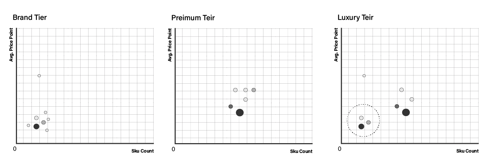

# 1.0 BERLIN MARKET ANALYSIS

## 1.1 EXECUTIVE SUMMARY
### 1.1.1 ABOUT
Berlin, a premium streetwear fashion brand, wants to expand by offering outerwear pieces in its collection. However, before launching the new product line, the company's President wants a high-level report analyzing current market trends and competitors. The Director of Marketing and Sales tasked me with performing market research and creating a report that highlights trends, market insights, and key recommendations using data analytics.

### 1.1.2 DATA STRUCTURE

Click to Learn about [data gathering](data-gathering.md) & [data cleaning](data-cleaning.md) process   

### 1.1.3 KEY PERFORMANCE INDICATORS (DASHBOARD)
Lorem ipsum dolor sit amet, consectetur adipiscing elit. Vivamus vulputate turpis non tristique rhoncus. Sed facilisis, nibh ac egestas tincidunt, orci massa hendrerit nisl, quis mollis lectus metus non dui. Aenean imperdiet magna in neque consectetur mattis. Integer faucibus tempor egestas. Duis ullamcorper eget nisl id malesuada. Quisque pulvinar justo vel rhoncus placerat. Curabitur ultricies facilisis ex semper ultrices. Vivamus vel dui vitae erat iaculis ultricies eu vel augue. Aliquam vel augue interdum, dignissim nisl at, tempor velit.
  

  
See fully interactive dashboard [here]()
### 1.1.4 MARKET SEGMENTATION

Lorem ipsum dolor sit amet, consectetur adipiscing elit. Vivamus vulputate turpis non tristique rhoncus. Sed facilisis, nibh ac egestas tincidunt, orci massa hendrerit nisl, quis mollis lectus metus non dui. Aenean imperdiet magna in neque consectetur mattis. Integer faucibus tempor egestas. Duis ullamcorper eget nisl id malesuada. Quisque pulvinar justo vel rhoncus placerat. Curabitur ultricies facilisis ex semper ultrices. Vivamus vel dui vitae erat iaculis ultricies eu vel augue. Aliquam vel augue interdum, dignissim nisl at, tempor velit.  
           • Insight 1 Description   
           • Insight 2 Description   

### 1.1.5 PRODUCT COMPARISION
Lorem ipsum dolor sit amet, consectetur adipiscing elit. Vivamus vulputate turpis non tristique rhoncus. Sed facilisis, nibh ac egestas tincidunt, orci massa hendrerit nisl, quis mollis lectus metus non dui. Aenean imperdiet magna in neque consectetur mattis. Integer faucibus tempor egestas. Duis ullamcorper eget nisl id malesuada. Quisque pulvinar justo vel rhoncus placerat. Curabitur ultricies facilisis ex semper ultrices. Vivamus vel dui vitae erat iaculis ultricies eu vel augue. Aliquam vel augue interdum, dignissim nisl at, tempor velit.  
           • Insight 1 Description   
           • Insight 2 Description   

### 1.1.6 BRAND COMPARISION
Lorem ipsum dolor sit amet, consectetur adipiscing elit. Vivamus vulputate turpis non tristique rhoncus. Sed facilisis, nibh ac egestas tincidunt, orci massa hendrerit nisl, quis mollis lectus metus non dui. Aenean imperdiet magna in neque consectetur mattis. Integer faucibus tempor egestas. Duis ullamcorper eget nisl id malesuada. Quisque pulvinar justo vel rhoncus placerat. Curabitur ultricies facilisis ex semper ultrices. Vivamus vel dui vitae erat iaculis ultricies eu vel augue. Aliquam vel augue interdum, dignissim nisl at, tempor velit.  
           • Insight 1 Description   
           • Insight 2 Description   
           • Insight 3 Description   

### 1.1.7 CONCLUSION
Lorem ipsum dolor sit amet, consectetur adipiscing elit. Vivamus vulputate turpis non tristique rhoncus. Sed facilisis, nibh ac egestas tincidunt, orci massa hendrerit nisl, quis mollis lectus metus non dui. Aenean imperdiet magna in neque consectetur mattis. Integer faucibus tempor egestas. Duis ullamcorper eget nisl id malesuada. Quisque pulvinar justo vel rhoncus placerat. Curabitur ultricies facilisis ex semper ultrices. Vivamus vel dui vitae erat iaculis ultricies eu vel augue. Aliquam vel augue interdum, dignissim nisl at, tempor velit.  
           • Insight 1 Description   
           • Insight 2 Description   
           • Insight 3 Description   
           

